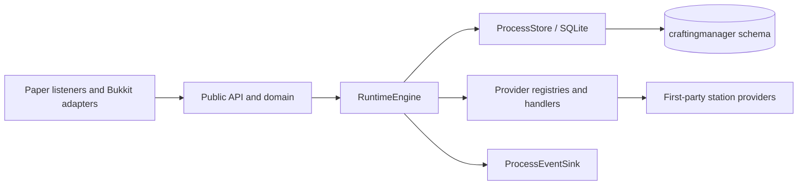
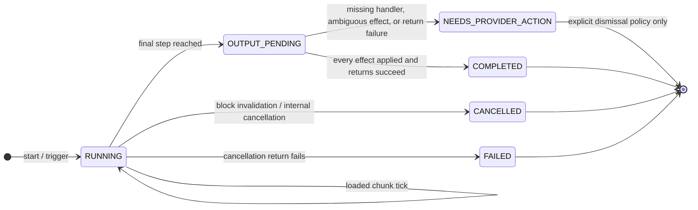
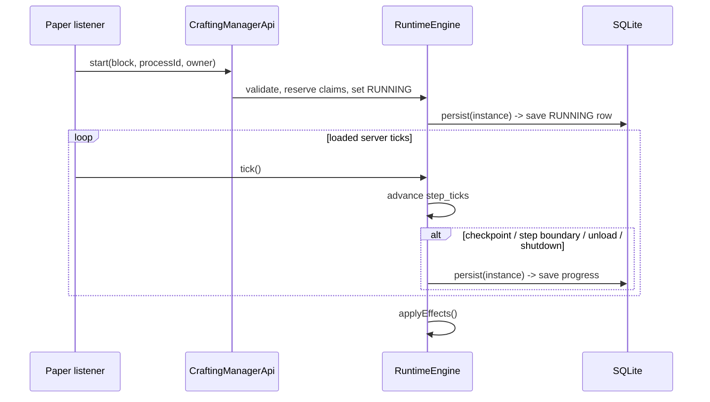
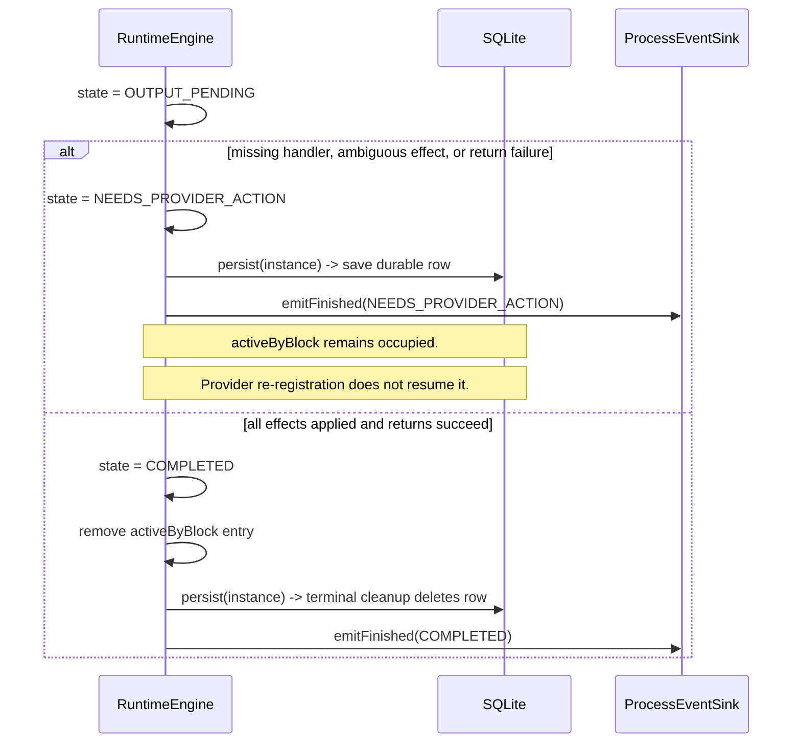

# Crafting Manager Architecture

## Scope

This document describes the repository as shipped today. Items marked **Next** are not implemented and must not be treated as public behavior.

## Package boundaries

- `api/` defines the SPI, immutable domain values, process events, and `CraftingManagerApi`.
- `runtime/` owns live registries, process execution, reservations, effect ledgers, block occupancy, and tick scheduling.
- `persistence/` owns SQLite access. Every SQL object is schema-qualified under `craftingmanager`.
- `paper/` translates Bukkit events and inventories into runtime calls. Bukkit world and inventory mutations stay on the server thread.
- `example/` contains the enabled first-party stations and the start-only example GUI.

Providers own definitions and handler registrations. The core owns live execution and durable instance/station state. Provider re-registration does not automatically reconcile or resume parked instances.

## Current process lifecycle

`ProcessState.PAUSED` is not assigned by the current engine. Chunk unload stops ticking while the state remains `RUNNING`; `step_ticks` is persisted and there is no wall-clock catch-up.

`NEEDS_PROVIDER_ACTION` is non-terminal. The instance remains in memory and in `activeByBlock`, so the host block remains busy. On restart, a saved row with a missing definition or handler is hydrated as `NEEDS_PROVIDER_ACTION` and remains busy. There is no public reconcile/resume transition today.

`ProcessFinishedEvent` / `emitFinished` is currently emitted for successful completion **and** parked, cancelled, or failed outcomes. It is not a success-only event.

## Start and tick sequence

The engine ticks only instances whose host chunk is tracked as loaded. Starting a process marks its host chunk loaded; Paper chunk events update that set.

## Completion and parked recovery

`persist(instance)` is the single persistence call at the engine boundary, but its result depends on state:

| State | SQLite effect | Block occupancy |
|---|---|---|
| `RUNNING`, `OUTPUT_PENDING` | Save/update row | Busy |
| `NEEDS_PROVIDER_ACTION` | Save/update durable row | Busy; remains in `activeByBlock` |
| `COMPLETED`, `CANCELLED`, `FAILED` | Delete row through `terminal()` | Released |

Completed rows are not a durable terminal audit in the current implementation. The in-memory instance can remain queryable until the engine is discarded, but a new engine cannot restore it from SQLite.

## Safe invalidation policy

A parked instance may have `APPLIED` and `UNKNOWN` ledger entries. Returning its original claims could duplicate inputs or outputs. Therefore invalidation routes by state:

- `RUNNING` → `cancel()`: return eligible claims, mark `CANCELLED`, release the block, delete the row.
- `NEEDS_PROVIDER_ACTION` → `dismiss()`: do not return claims, do not execute effects again, remove the instance from memory and `activeByBlock`, delete the row, and release the block.

This policy is implemented before any future public cancel API. A public cancel operation must preserve the same distinction; parked instances require an explicit dismissal or reconciliation policy, not an automatic refund.

## Current versus Next

### Current

- Provider registrations for processes, blocks, triggers, inventory adapters, and effect handlers.
- Three first-party stations: alloy smelter, gem polisher, and tonic mixer.
- Synchronous SQLite persistence and restart hydration.
- Ordered loaded-chunk ticking with progress checkpoints.
- Unified completion ledger with no rerun of applied effects.
- Paper interaction, hopper I/O, block invalidation, and process usage events.

### Next

- Public cancel/dismiss and instance/progress query APIs, with focused tests and GUI integration afterward.
- Off-main-thread SQLite writes with revision-checked apply-back.

The example GUI is intentionally start-only until the public process-control and query contract exists.
